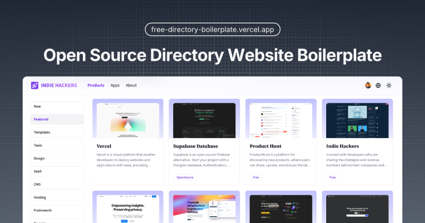
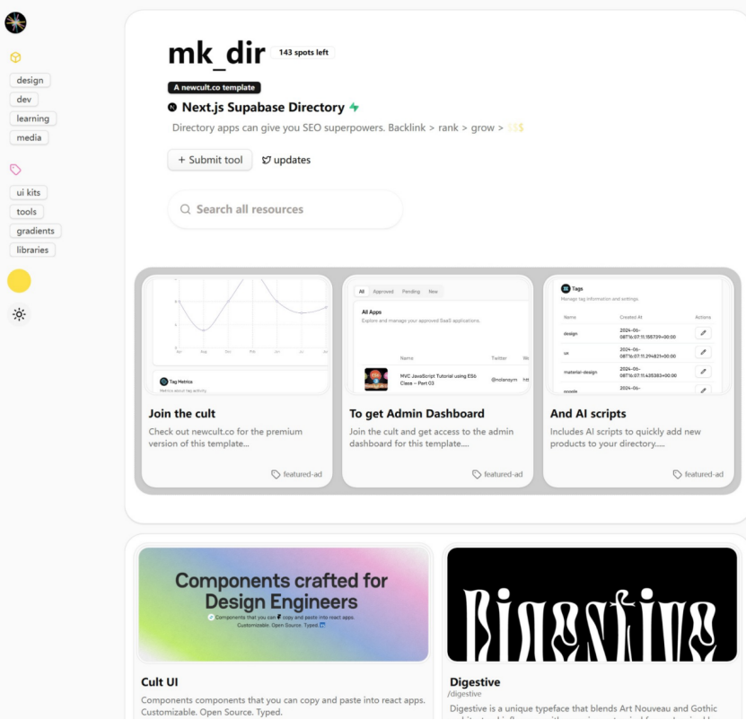

# Guide to Creating AI Directory Tools Websites

In the AI era, AI-powered navigation websites are gaining popularity. As more AI applications are deployed on the web, directory navigation sites have become increasingly valuable. Examples like [toolify.ai](https://toolify.ai) and [futuretools.io](https://futuretools.io) have achieved significant traffic and commercial success. Below, we’ve compiled nearly ten mainstream solutions for building directory websites, carefully curated for your reference.

## Solutions Overview

### 1. Aigotools
**Description**: A free, open-source directory website program that enables users to quickly create and manage navigation sites. It includes built-in site management, automatic content crawling, internationalization, SEO optimization, and multiple image storage options.

**Advantages**:
- Free and open-source
- AI-driven content generation

**Disadvantages**:
- Requires some programming knowledge

**Resources**:
- GitHub: [https://github.com/someu/aigotools](https://github.com/someu/aigotools)
- Official Website & Demo: [www.aigotools.com](https://www.aigotools.com)

---

### 2. Tap4 AI
**Description**: An open-source directory navigation program built with Next.js and Tailwind CSS, offering a lightweight and aesthetically pleasing design. It comes in two versions:
1. Lightweight version without crawling: [tap4-ai-webui-lite](https://github.com/6677-ai/tap4-ai-webui-lite)
2. Version with automatic crawling: [tap4-ai-crawler](https://github.com/6677-ai/tap4-ai-crawler) and [tap4-ai-webui](https://github.com/6677-ai/tap4-ai-webui)

**Advantages**:
- Free and open-source
- Vercel deployment
- AI-driven
- Comprehensive documentation

**Disadvantages**:
- No backend management
- Requires direct database operation (Supabase)

**Demo**: [www.tap4.ai](https://www.tap4.ai)

**Image**:

---

### 3. MkDirs
**Description**: MkDirs offers both free and paid versions.

#### Free Version
- Built with Next.js, NextAuth, and PostgreSQL
- Supports English and Chinese

**Advantages**:
- Two language options

**Disadvantages**:
- Lacks detailed installation documentation
- Requires database purchase and configuration

**Resources**:
- GitHub: [https://github.com/javayhu/free-directory-boilerplate](https://github.com/javayhu/free-directory-boilerplate)
- Demo: [https://free.mkdirs.com](https://free.mkdirs.com)

**Image**:

#### Paid Version
- The most comprehensive directory program tested, with one-click Vercel installation and Sanity Studio backend integration
- Includes payment, submission, and advertising features
- Multi-project use with lifetime updates

**Advantages**:
- Easy installation with detailed tutorials
- Multi-project compatibility

**Disadvantages**:
- Costs $99

**Demo**: [https://demo.mkdirs.com](https://demo.mkdirs.com)

---

### 4. Directify
**Description**: A SaaS-based solution that requires no installation or technical experience. Simply configure your domain and basic settings to get started.

**Advantages**:
- Ready to use out of the box

**Disadvantages**:
- Expensive: $19/month for a single site, $49/month for unlimited sites

**Note**: The unlimited sites plan is cost-effective for building multiple directory websites.

**Official Website**: [https://directify.app](https://directify.app)

---

### 5. Cult-Directory
**Description**: A Next.js frontend with Supabase backend, available in free and paid versions. The free version lacks a management backend and payment features. The paid version, accessed via a membership, includes additional templates like logo design and Travel Stash.

**Free Version**:
- GitHub: [https://github.com/nolly-studio/cult-directory-template](https://github.com/nolly-studio/cult-directory-template)
- Demo: [https://www.nextjs.design](https://www.nextjs.design)

**Paid Version**:
- Membership: $129/year
- Purchase: [https://pro.cult-ui.com](https://pro.cult-ui.com)

**Advantages**:
- Free version available
- Paid version includes multiple templates

**Disadvantages**:
- Limited detailed descriptions in directories, less favorable for SEO

**Image**:

---

### 6. Gitbase
**Description**: A simple, open-source, database-free program template ideal for basic directory websites.

**Advantages**:
- Easy to use
- One-click Vercel installation
- No database required

**Disadvantages**:
- Limited to links only, no detailed descriptions or image display

**Resources**:
- GitHub: [https://github.com/qiayue/gitbase](https://github.com/qiayue/gitbase)
- Demo & Official Website: [https://gitbase.app](https://gitbase.app)

---

### 7. Pagegen.ai
**Description**: An AI-powered platform for generating websites using predefined templates, suitable for directory websites.

**Template URL**: [https://pagegen.ai/generate-template?templateId=directory-1](https://pagegen.ai/generate-template?templateId=directory-1)

**Advantages**:
- Quick generation using templates
- Affordable, starting at $9

**Disadvantages**:
- Requires some programming knowledge

**Image**:

---

### 8. WordPress + Directory Template
**Description**: WordPress, the most popular website-building platform, can be used with a suitable template to create directory websites.

**Tutorial Video**: [https://www.youtube.com/watch?v=T6FcF0rVpJo](https://www.youtube.com/watch?v=T6FcF0rVpJo)

**Recommended Template**: [1Page - Masonry WordPress News](https://themeforest.net/item/1page-masonry-wordpress-news-interesting-links/6831624)

**Image**:

---

## Summary
Each solution caters to different needs and technical expertise levels:
- **Beginners**: Directify or WordPress for ease of use
- **Developers**: Aigotools, Tap4 AI, or MkDirs for customization
- **Budget-Conscious**: Free versions of Gitbase or Cult-Directory
- **Scalability**: MkDirs paid version or Directify’s unlimited plan

Choose the solution that best aligns with your goals, budget, and technical skills.
